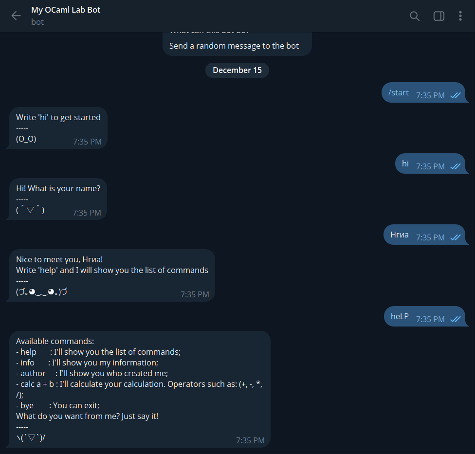
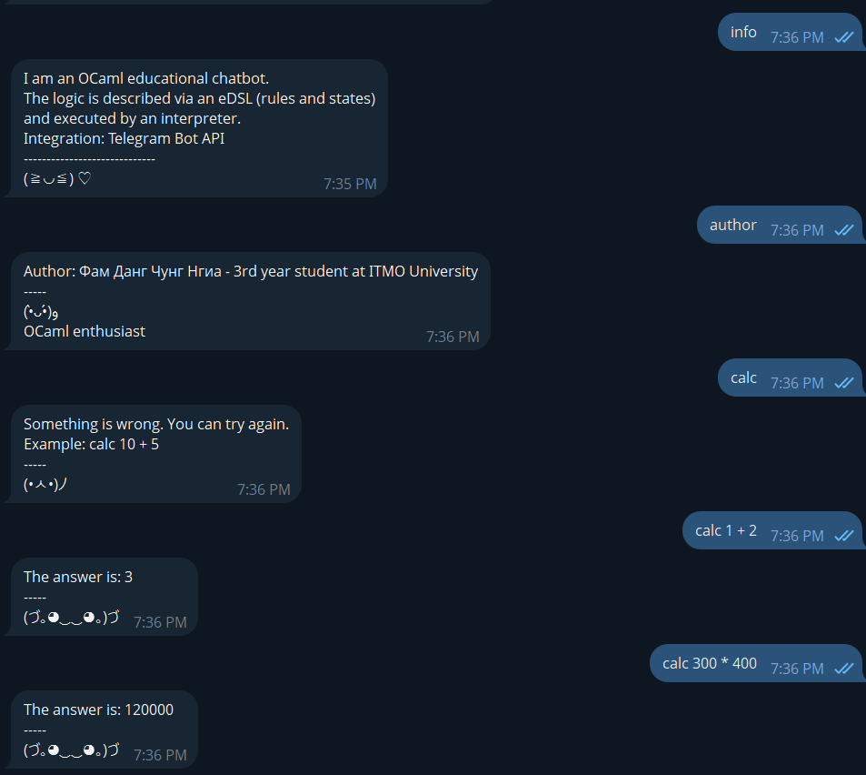

# Лабораторная работа 4

- Студент: Фам Данг Чунг Нгиа
- Группа: P3321
- ИСУ: 374806
- Функциональный язык: OCaml

## Описание работы
**Цель**: получить навыки работы со специфичными для выбранной технологии/языка программирования приёмами.

**Общие требования**:
- программа должна быть реализована в функциональном стиле;
- требуется использовать идиоматичный для технологии стиль программирования;
- задание и коллектив должны быть согласованы;
- допустима совместная работа над одним заданием.

**Вариант**: Реализация чат-бота на OCaml с eDSL, интерпретатором и интеграцией с Telegram Bot API.

## Примеры использования бота

[My OCaml Lab Bot](https://t.me/ocaml_lab4_bot)





## Выполнение

### Архитектура приложения
```text
SYSTEM FLOW (from chatbot logic to Telegram and back)

+====================================================================+
|                        1) eDSL CHATBOT MODEL                        |
+====================================================================+
|  Declarative description of behavior                                |
|                                                                    |
|  - States                                                          |
|  - Rules (patterns)                                                 |
|  - Actions (say / sayf / goto)                                      |
|                                                                    |
|  Example:                                                          |
|    state "main"                                                     |
|      rule (Exact "help") [ say "..."; ]                             |
|      rule Any [ say "..."; ]                                        |
+====================================================================+
                              |
                              | (bot description)
                              v
+====================================================================+
|                        2) INTERPRETER ENGINE                        |
+====================================================================+
|  interpret(bot, current_state, text_raw)                            |
|                                                                    |
|  Steps:                                                            |
|   1. normalize input (for command matching)                         |
|   2. find current state                                             |
|   3. find first matching rule                                       |
|   4. execute actions (immutable):                                   |
|        - Say / Sayf  -> build replies                               |
|        - Goto        -> change state                                |
|   5. return (next_state, reply_text)                                |
+====================================================================+
                              |
                              | (next_state, reply_text)
                              v
+====================================================================+
|                  3) TELEGRAM INTEGRATION LAYER                      |
|                  (OCaml + Lwt + HTTP client)                        |
+====================================================================+
|  - get_updates(token, offset)                                       |
|      -> GET /getUpdates (long polling)                              |
|      -> receive updates (chat_id, text)                             |
|                                                                    |
|  - send_message(token, chat_id, reply_text)                         |
|      -> POST /sendMessage                                          |
+====================================================================+
                              |
                              | message delivered via Telegram API
                              v
+====================================================================+
|                        4) TELEGRAM USER CHAT                        |
+====================================================================+
|  - User sends message                                               |
|  - User receives bot reply                                          |
+====================================================================+

FULL LOOP (runtime):

User message
   ↓
Telegram server stores UPDATE
   ↓
get_updates(...)
   ↓
Interpreter processes message (FSM + rules)
   ↓
send_message(...)
   ↓
User sees reply
```
### Ключевые элементы реализации

#### eDSL для создания чат-бота
```ocaml
(* ==== Definition of bot structure ====*)
(* Pattern to match user input *)
type pattern =
  | Exact of string
  | Contains of string
  | Starts_with of string
  | Any

(* Action performed by the bot *)
type action = Say of (string -> string) | Goto of string

(* Rule: pattern + list of actions *)
type rule = { pattern : pattern; actions : action list }

(* State of chatbot *)
type state = { name : string; rules : rule list }

(* Chatbot definition *)
type bot = { initial_state : string; states : state list }

(* ==== Declaration functions ==== *)
let rule pattern actions = { pattern; actions }
let state name rules = { name; rules }
let chatbot initial_state states = { initial_state; states }

(* ==== Bot's actions ==== *)
(* bot send fixed reply *)
let say text = Say (fun _ -> text)

(* bot send dynamic reply (using sent user's message) *)
let sayf f = Say f

(* change bot's state *)
let goto state_name = Goto state_name
```

#### Интерпретер для работы чат-бота
```ocaml
(* ===== Interpreter ===== *)
let interpret (b : bot) (current_state : string) (text_raw : string) :
    string * string =
  let text_cmd = normalize_for_command text_raw in

  match find_state b current_state with
  | None -> (b.initial_state, "Internal error: unknown state, resetting.")
  | Some st -> (
      match find_first_matching_rule st.rules text_cmd with
      | None -> (current_state, "Internal error: no rule matched.")
      | Some r ->
          let next_state, replies_rev =
            exec_actions current_state text_raw r.actions
          in
          let replies = List.rev replies_rev in
          let reply_text =
            match replies with [] -> "" | xs -> String.concat "\n" xs
          in
          (next_state, reply_text))
```

#### Интеграция с telegram
```ocaml
(* ==== Adapter's general actions ==== *)
(* get new message list from user in telegram *)
let get_updates ~token ~offset =
  let url =
    api_url token "getUpdates" ^ "?timeout=25" ^ "&offset="
    ^ string_of_int offset
  in
  http_get_json url >|= parse_updates

(* send message to user *)
let send_message ~token ~chat_id ~text =
  let url = api_url token "sendMessage" in
  let params = [ ("chat_id", string_of_int chat_id); ("text", text) ] in
  http_post_form url params >|= fun _ -> ()
```

## Как запустить?

```bash
export TELEGRAM_BOT_TOKEN="..."
dune exec ocaml-chatbot-edsl
```

## Тестирование

В рамках данной работы были применён инструмент:

  * [Alcotest](https://opam.ocaml.org/packages/alcotest/) - для модульного тестирования (unit testing)

### Тест 1: start → ask_name

* Вход: состояние start, сообщение "hi"
* Выход: состояние ask_name, ответ содержит запрос имени пользователя.
* Пример: ("start", "hi") → ("ask_name", "Hi! What is your name?")

### Тест 2: ask_name → main

* Вход: состояние ask_name, сообщение с именем пользователя
* Выход: состояние main, ответ содержит имя без изменения.
* Пример: ("ask_name", "Нгиа") → ("main", "Nice to meet you, Нгиа!")

### Отчёт инструмента тестирования
```bash
  Testing `chatbot'.
  This run has ID `5XNZMWPT'.
  
    [OK]          fsm          0   start: hi -> ask_name.
    [OK]          fsm          1   ask_name keeps raw name.
  
  Full test results in `~/work/functional_programming_lab_4/functional_programming_lab_4/ocaml-chatbot-edsl/_build/default/test/_build/_tests/chatbot'.
  Test Successful in 0.000s. 2 tests run.
```

## Выводы

В ходе лабораторной работы была разработана eDSL для описания логики чат-бота в виде конечного автомата (состояния, правила и действия). Реализован интерпретатор, который выполняет описание eDSL в функциональном стиле без мутабельного состояния и возвращает новое состояние и текст ответа. Для демонстрации практической применимости выполнена интеграция с Telegram Bot API в режиме long polling (получение обновлений и отправка сообщений). Работоспособность подтверждена модульными тестами (переходы между состояниями и сохранение исходного ввода пользователя).